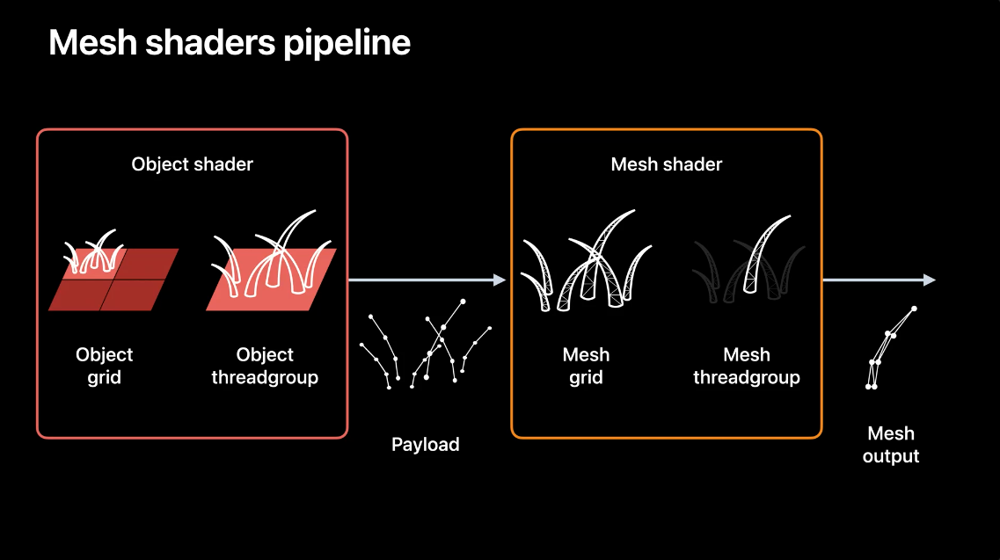
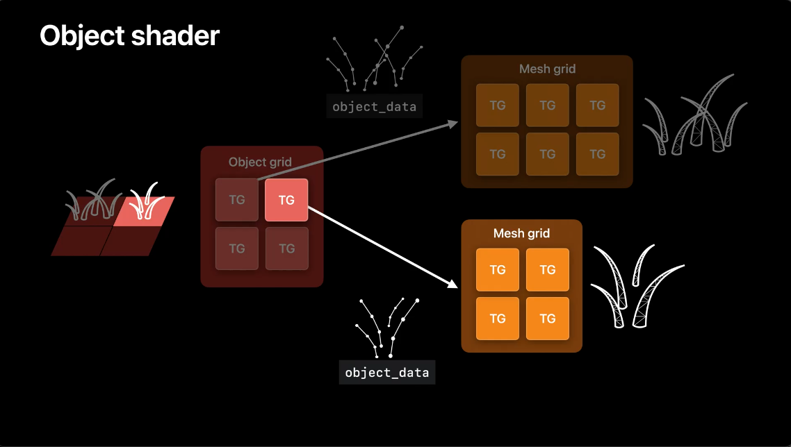
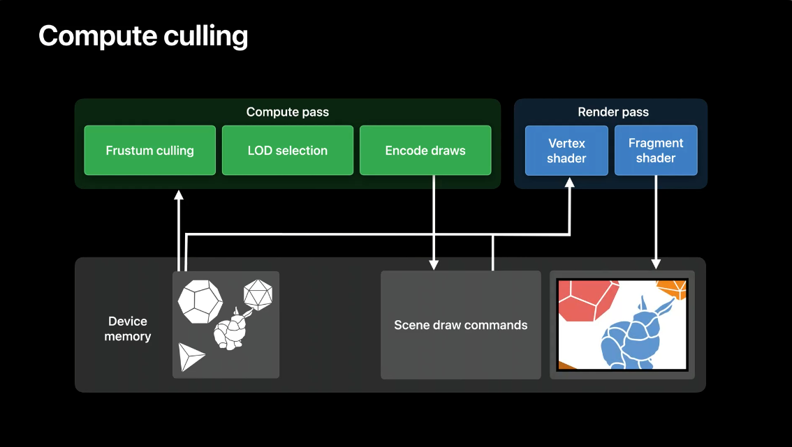
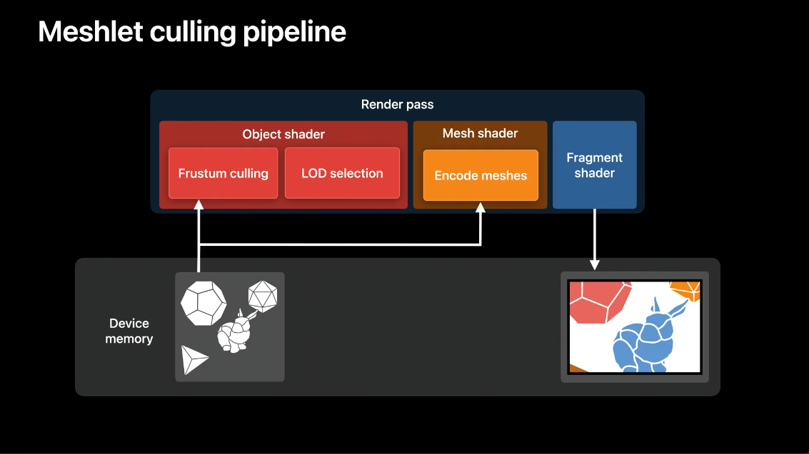
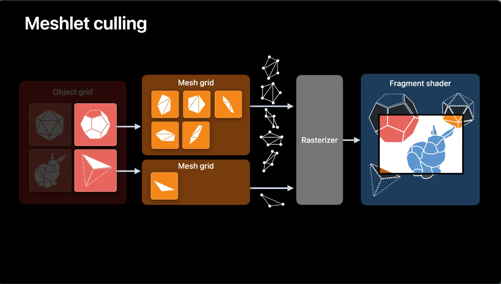

 - Hi! My name is Andrei.
 I'm a GPU software engineer with Metal Frameworks team.
  Today, I'm excited to introduce to you Metal mesh shaders.
  Mesh shaders is the new flexible pipeline in Metal for GPU-driven geometry creation and processing.
  It improves on the vertex/fragment pipeline, adding a lot of flexibility and removing the limitations of per-vertex processing.
  It has multiple applications, , but not limited to: **fine-grained geometry culling, scalable procedural geometry creation on the GPU, and allowing custom geometry inputs such as compressed vertex streams, meshlets and complex procedural algorithms.**
  I would like to cover these three things today.
  First, I will go over what Metal mesh shaders are.
  Then, I would like to tell you about two mesh shaders use cases.
  Mesh shaders are great for generating procedural geometry such as rendering procedural hair.
  Mesh shaders also help improve scene processing and rendering.
  A primary example of this is using mesh shaders to implement GPU-driven meshlet culling.
  Let's start with introducing mesh shaders.
  Here is the Stanford Bunny, which represents a typical mesh that you could render on the GPU.
  In order to render this mesh, the vertex and index data would first have to be placed in the device memory.
  You would then have to use render command encoder to execute a draw call.
  A traditional rendering pipeline consists of three fundamental stages: A programmable vertex shader stage, a fixed-function rasterization stage, and a programmable fragment shader stage.
  The vertex shader stage would take geometry from device memory as an input and process it.
  The rasterizer would produce screen space fragments, and the fragment shader would shade them to produce the final image.
  This pipeline has been, and still is, serving its purpose extremely well.
  However, it lacks flexibility and has certain limitations.
  Let's step through an example.
  Imagine that you want to generate some procedural geometry on the GPU.
  For example, you've decided to add procedural fur to this bunny.
  Let me show you how this task is handled by the traditional geometry pipeline.
  Traditionally, in order to generate procedural geometry, you would also need to have a compute command encoder that would perform a compute kernel dispatch.
  The compute kernel would take the origin You would then use a render command encoder to execute a draw call that would take procedural geometry as an input and produce a final image .
  Not only does this approach require two command encoders, it also requires you to allocate additional memory to store the procedural geometry.
  In case of indirect draw calls or high expansion factors, the amount of this memory can be quite high and hard to predict.
  There is also a barrier between the two encoders, serializing work across the GPU.
  Metal mesh shaders addresses all of those issues.
  Mesh shaders is a new geometry pipeline that replaces the vertex shader stage with two new programmable stages-- the object shader stage and the mesh shader stage.
  In this example, the object shader would take geometry as an input , process it and output some data-- which we call "payload"-- to the mesh shader.
  It is up to you to decide what this data is.
  The mesh shader, in turn, would use this data to generate procedural geometry.
  This procedural geometry would only exist inside the draw call, so it would not require you to allocate any device memory.
  It would be pipelined straight to the rasterizer and then to a fragment shader that would produce the final image.
  Mesh draw calls are performed using the same type of render command encoder as the traditional draw calls.
  Mesh draw calls and traditional draw calls can be mixed and matched.
  Now, let's take a look at two new programmable stages.
 In contrast to vertex shaders, object and mesh shaders are similar to compute kernels.
  They are launched in grids of thread groups.
  Each thread group is a grid of individual threads that, like compute threads, can communicate with each other.
  Additionally, each object thread group can spawn a mesh grid and programmatically define the size of the mesh grid it launches, providing plenty of flexibility.
  Each object thread group passes payload data to the mesh grid it spawns.
  As the name suggests, the object stage processes objects.
  Object is an abstract concept that you can define according to your needs.
  It can be a scene model, a part of a scene model or, for example, a region of space where you want to generate procedural geometry.
  The mesh stage is designed to build meshes and send geometry data directly to the rasterizer.
  The next two examples will cover the relation between objects and meshes.
  The first one is using mesh shaders to implement hair rendering.
  To simplify this task, instead of the Bunny model, I'll use a simple plane.
  To generate a patch of hair, I'll divide the input geometry into tiles, where each tile will calculate a level of detail and the number of strands it needs to produce, and then generate each individual strand of hair.

 

 ### Hair Rendering

  Let me show you how to procedurally generate hair on this plane using mesh shaders.
  The plane can be split into tiles, where each tile corresponds to an object threadgroup.
  Each object threadgroup will calculate the number of hair strands and generate the curve control points for each strand.
  This will become the **payload**.
  Our object threadgroup then launches a mesh grid, where each mesh threadgroup represents a single strand of hair.
  Each mesh threadgroup outputs the mesh to the rasterizer.
  The new geometry pipeline allows you to map your geometry processing closely to hardware and enables you to take full advantage of all the threads your GPU offers.
  In a mesh render pipeline, input geometry is split into tiles for the object shader grid.
  Each object shader threadgroup can independently generate a payload and launch a mesh grid.
  Each mesh shader threadgroup from the grid generates a metal::mesh which is further processed in the rest of the rendering pipeline.

 

  Let's take a closer look at the data produced by each of those stages.
  The payload is defined in the object shader.
  Each object threadgroup passes the customized payload to the generated mesh grid that an object threadgroup spawns.
  In the case of hair rendering, the payload consists of the curve control points.
  Meanwhile, the mesh shader outputs vertex and primitive data through a new metal::mesh type, which I will discuss in further detail in a bit.
 The object and mesh stages output mesh data that is consumed by rest of the pipeline.
  Similar to the vertex output from the traditional pipeline, the mesh data is first consumed by the rasterizer, then the fragment shader executes.

  Let's take a deeper dive into how to set up a hair rendering mesh pipeline.
  First, the plane that is to be covered in hair is split into tiles, where each tile corresponds to an object threadgroup.
  The object threadgroup determines the mesh grid size and initializes the payload data that it passes to the mesh grid.
  In this case, the tile has six strands of hair and generates a 3x2 mesh grid, along with a curve payload data for each strand.
 Each threadgroup can generate unique mesh grid sizes.
  For the next threadgroup, only four strands of hair need to be generated, so a 2x2 mesh grid is set along with initializing curve payload data for 4 strands.
  This is how the object shader that implements this approach looks like.

 

 

  The object attribute has been added to Metal to specify what code is an object shader.
  In addition to the payload attribute and object_data address space, allow payload arguments to be used in shaders.
 The mesh grid properties argument is used to encode the mesh grid size.

 ####  The next step is pipeline initialization.

  First, allocate the mesh render pipeline descriptor, then initialize the object function and specify the desired payload length, along with the maximum number of threads per threadgroup.

 #####  There are certain constraints on object shaders.

  Payload format and contents are fully customizable.
  However, payload size can't exceed the limit of 16 kilobytes.
  Also, the maximum number of mesh threadgroups that each object threadgroup produces can't exceed 1024.
  The next step after getting the object shader stage ready is initializing the mesh shader stage.
  The mesh shader has the user defined payload as an input.
  In this example, the payload is the set of curve control points.
  Each mesh threadgroup produces a metal::mesh, which is a single strand of hair.
  The output mesh of the mesh shader must have a metal::mesh type.
  A metal::mesh is a built-in structure in Metal that provides you an interface to output vertex and primitive data to the rasterizer and fragment shader.
  Each metal::mesh defines a vertex data type, much like the output type of a vertex shader, a primitive data type, the maximum number of vertices, the maximum number of primitives, and finally, the mesh topology-- either point, line, or triangle.
  The mesh attribute was added to Metal shading language to specify what code is a mesh shader.
  Metal::mesh is used as an output structure in the mesh shader.
 Mesh shaders are great for GPU-driven geometry processing as they allow you to produce these metal::meshes on the fly for the rasterizer to consume.
  Mesh shaders leverage the metal::mesh to their advantage so you can put more processing into render commands without having additional compute passes.
  Encoding a mesh is done across threads within the same thread group.
  In this example, the first 9 threads of a thread group will encode the vertex, index, and primitive data of this hair strand.
  Threads 0 through 4 each encode one vertex in the mesh.
  The remaining threads in the thread group do not encode vertices in the mesh.
  Next, all 9 threads encode one index into the mesh indices.
 Next, the first three threads encode primitive data for the three triangles.
  The rest of the threads don't encode any primitive data.
  And lastly, one thread shall encode the primitive count for the metal::mesh.
  Let me show you the source code for this mesh shader.
  The mesh shader is organized to avoid as much divergence in threads as possible--following the same steps to encode vertex, index and primitive data, and finally the primitive count.
 Let's switch back to initializing the mesh pipeline descriptor.
  On the mesh pipeline descriptor, the mesh function along with the maximum threads per mesh thread group, is set.

 #####  There are limits that metal::mesh structure needs to adhere to.

  Metal::mesh shaders have the following limits: metal::mesh supports up to 256 vertices and up to 512 primitives.
  The total size of metal::mesh cannot exceed 16 kilobytes.
  Now that the mesh grid has generated the metal::meshes, these are then fed to the rasterizer and finally the fragment shader is run.
  So, similar to the traditional render pipeline, the fragment function is set on the mesh pipeline descriptor.
  Now that the descriptor has been initialized, the pipeline state is created through the "make render pipeline state with mesh descriptor" method on the Metal device.
  Encoding a mesh pipeline is very similar to encoding a traditional draw call.
  The pipeline state is set on the encoder.
  Each stage in the pipeline can have resources bound.
  In this example the bound resources are: an object buffer to an object stage, a texture to a mesh stage, and a fragment buffer to a fragment stage.
  Next, I'm defining a few constants that I'll need to launch the mesh pipeline: object grid dimensions, number of threads per object threadgroup, number of threads per mesh threadgroup, and use these constants to encode the draw through the new "draw mesh threadgroups" method.
  The same approach that is used to render a plane of hair can be applied to the whole bunny to procedurally generate fur through a mesh pipeline.

 ##  Next, let's look at another way to use mesh shaders.

  Mesh shaders can be used to efficiently process and render large amounts of geometry using meshlet culling.
  The basis for this technique is splitting the scene meshes up into smaller pieces called **meshlets**.
 Splitting scene geometry into meshlets increases the granularity of the scene, allowing more efficient and fine-grained culling.
  This allows you to greatly reduce geometry overhead.
  Leveraging meshlet granularity processing allows for efficient occlusion and culling algorithms such as screen space occlusion culling and normal filtering.
  You can use mesh shaders to implement a fully GPU-driven culling and rendering pipeline.
 Here is a traditional GPU-driven pipeline that performs scene processing and rendering using one compute and one render pass.
  The scene data is split into meshlets and fed into the compute pass, which is responsible for frustum culling, LOD selection, and encoding the draws to device memory.
  The render pass then executes the draw commands for the scene and produces the final image.

 

  Using mesh shaders, it is possible to remove synchronization points and avoid the intermediate draw commands by merging two passes into a single mesh shader dispatch.
  Let me show you how it can be done.
  Here is a single render pass that executes a mesh shader dispatch.
  The object shader performs frustum culling and calculates LODs for each of the visible meshlets.
  The payload to the mesh shader is a list of meshlet IDs that should be encoded.
  The mesh shader then encodes the metal::mesh objects that shall be rasterized and shaded.
  The final image is then shaded in the fragment shader, identical to the traditional pipeline.

 
 
  The geometry processing is done entirely within the mesh threadgroups command and within a single encoder.
  There is no longer a need for an intermediate buffer to store these draw commands, as the triangle data is encoded in the mesh shader.
 Let's turn our attention to culling now-- specifically, an implementation of meshlet culling.
  The scene consists of models represented by the shapes here.
  In this implementation, each model of the scene will become part of the object grid.
  The mesh grids spawned by the object shader threadgroups will consist of meshlets-- patches of triangles that make up the surface of the model.
  The new geometry pipeline is very flexible.
  It is up to you to decide how to map your scene onto an object grid.
  In this example, I'm mapping each model to an object threadgroup, but you can use the mapping that better suits your task.
  Now, the object shader will determine the visibility of meshlets using the viewing frustum and dispatch work only for what will be presented in the final image.
  Let's focus on two models from the scene.
  The object shader launches mesh grids based on determined visibility.
  The mesh shader then processes the meshlets and constructs metal::meshes.
  The programmable mesh grid size enables flexible dispatching so only visible meshlets get processed by the mesh shader.
  This reduces the time spent processing unseen geometry later in the pipeline.
  The fixed function rasterizer only receives surfaces that are known to be visible and will reduce time spent processing and clipping out unseen geometry.
 Finally, the programmable fragment shader is invoked and produces the final image.
 
 
 
 As you can see, there are a wide variety of problems that the new geometry pipeline allows you to address such as creating procedural meshes or making your draw calls more efficient, as demonstrated in this meshlet culling example.
  Metal now includes a new geometry pipeline that is modern and flexible.
  It is now easier than ever before to create procedural geometry, as demonstrated in the hair rendering example.
  Additionally, the possibilities for GPU-driven work in a single render pass have expanded without requiring additional compute passes or intermediate buffers, as seen in the meshlet culling demo.
 This new geometry pipeline is available in Family7 and Mac2 devices.
 To help you start learning and experimenting with mesh shaders, a sample code is available on Apple developer web site that shows how to use the new API.
  I'm excited to see how you use this feature and utilize the massively parallel nature of Apple GPUs to fit your geometry processing needs.
  Thank you so much for watching!