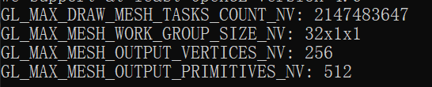

Mesh Shaders 是 NVIDIA Turing架构GPU的特性。Mesh shader渲染管线替代了传统VTG渲染管线（Vertex, Tessellation, Geometry），可以看作是compute shader和fragment shader的结合。就像compute shader一样，可以设置工作组和线程数，还可以在线程之间使用`barrier()`进行同步。

Mesh shaders引入了两个新的着色阶段，**task shader**和**mesh shader**。

Mesh shader的一个能力是可以过程性地生成图元而不需要输入数据。

filling vertices and face indices arrays send it to the rasterizer( and then to the pixel shader).

在OpenGL中，mesh shaders 通过 `GL_NV_mesh_shader`扩展暴露，可以通过`GLAD_GL_NV_mesh_shader`或`GL_NV_mesh_shader`检查是否支持。在mesh shader中需要添加扩展`#extension GL_NV_mesh_shader : require`。


查看mesh shader的硬件限制：

```c++
glGetIntegerv(GL_MAX_DRAW_MESH_TASKS_COUNT_NV, &x);

glGetIntegeri_v(GL_MAX_MESH_WORK_GROUP_SIZE_NV, 0, &x);
glGetIntegeri_v(GL_MAX_MESH_WORK_GROUP_SIZE_NV, 1, &y);
glGetIntegeri_v(GL_MAX_MESH_WORK_GROUP_SIZE_NV, 2, &z);

glGetIntegerv(GL_MAX_MESH_OUTPUT_VERTICES_NV, &x);
glGetIntegerv(GL_MAX_MESH_OUTPUT_PRIMITIVES_NV, &x);
```

rtx2060输出如下：




mesh shader 主要填充三个内建变量：

`gl_MeshVerticesNV`，顶点数组

`gl_PrimitiveIndicesNV`，索引数组

`gl_PrimitiveCountNV`，图元数


` glDrawMeshTasksNV(offset, count)` 调用。


顶点数和图元数有限制，怎么产生一个大的网格呢？把大的网格拆分成小的meshlets，每个meshlet由一个工作组处理。

meshlet的结构类似于

```c++
struct Meshlet{
	uint32_t vertices[64];
	uint indices[378]; // up to 126 triangles
	uint32_t vertex_count;
	uint32_t index_count;
}
```

meshlet只存索引。


NVIDIA in [this article](https://devblogs.nvidia.com/introduction-turing-mesh-shaders/) recommends using up to 64 vertices and 126 primitives。