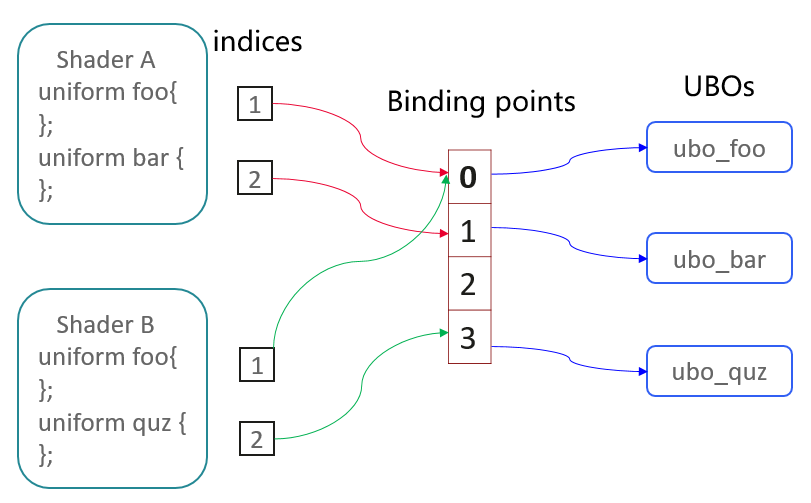

struct alignas


DSA(Direct State Access)


<b>glCreateBuffers</b>

- 一个缓冲对象通过把`GenBuffers`返回的名称绑定到目标缓冲区来创建。绑定通过`void BindBuffer( enum target, uint buffer );`来完成。

- `glCreateBuffers`没有目标，因为它没有具体的缓冲对象。

- `glGenBuffers`它只返回一个未使用的名称，同时`glCreateBuffers`还创建和初始化状态向量。


<b>glNamedBufferStorage</b> — creates and initializes a buffer object's <font color = red>immutable </font>data store

```c++
void glNamedBufferStorage(	GLuint buffer,
 	GLsizeiptr size,  //Specifies the size in bytes of the buffer.
 	const void *data, //data that will be copied, or NULL if no data is to be copied.
 	GLbitfield flags);//intended usage of the buffer's data store.
```

- The key here is 'immutable' means you can't resize or de-allocate it in the future, but not means you can't write/read data in it.


<b>glNamedBufferData</b> — creates and initializes a buffer object's data store

```c++
void glNamedBufferData(	GLuint buffer,
 	GLsizeiptr size,
 	const void *data,
 	GLenum usage);

// The symbolic constant must be GL_STREAM_DRAW, GL_STREAM_READ, GL_STREAM_COPY, GL_STATIC_DRAW, GL_STATIC_READ, GL_STATIC_COPY, GL_DYNAMIC_DRAW, GL_DYNAMIC_READ, or GL_DYNAMIC_COPY.
```


<b>glBindBufferBase</b> — bind a buffer object to an indexed buffer target

```c++
void glBindBufferBase(	GLenum target,
 	GLuint index,
 	GLuint buffer);

/*target
  Specify the target of the bind operation. target must be one of GL_ATOMIC_COUNTER_BUFFER, GL_TRANSFORM_FEEDBACK_BUFFER, GL_UNIFORM_BUFFER or GL_SHADER_STORAGE_BUFFER.
*/
```


[SSBO、UBO](https://developer.huawei.com/consumer/cn/forum/topic/0204393528146900119)

---

<b>glCreateVertexArrays</b> — create vertex array objects

```c++
void glCreateVertexArrays(	GLsizei n,
 	GLuint *arrays);
```


<b>glVertexArrayVertexBuffer</b> — bind a buffer to a vertex buffer bind point

```c++
void glVertexArrayVertexBuffer(	GLuint vaobj,
 	GLuint bindingindex,
 	GLuint buffer,
 	GLintptr offset,
 	GLsizei stride);
```


<b>glEnableVertexAttribArray</b> — Enable or disable a generic vertex attribute array

```c++
void glEnableVertexArrayAttrib(	GLuint vaobj,
 	GLuint index);
```


<b>**glVertexArrayAttribBinding**</b> — associate a vertex attribute and a vertex buffer binding for a vertex array object

```c++
void ( GLuint vaobj,
 	GLuint attribindex,
 	GLuint bindingindex);
```


<b>glVertexArrayAttribFormat</b> — specify the organization of vertex arrays

```c++
void glVertexArrayAttribFormat(	GLuint vaobj,
 	GLuint attribindex,
 	GLint size, // number of type
 	GLenum type,
 	GLboolean normalized,
 	GLuint relativeoffset); //The distance between elements within the buffer.(bytes)
```