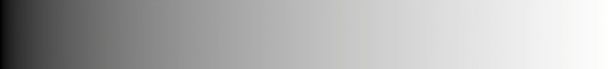
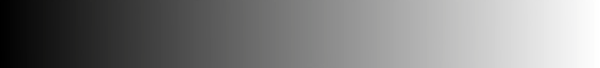
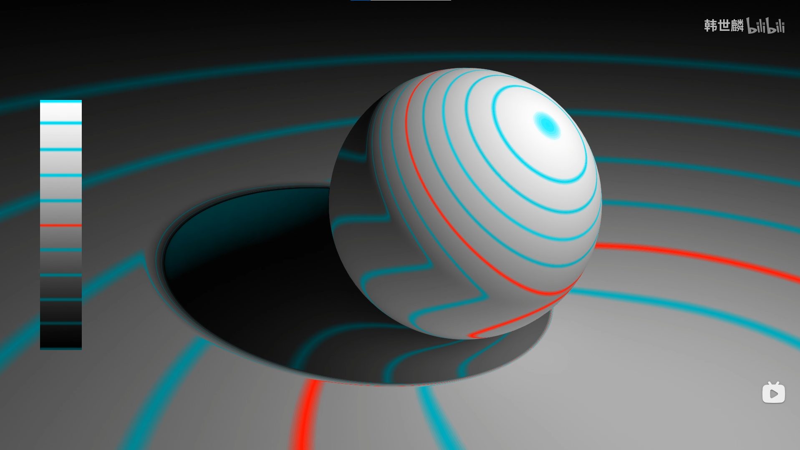
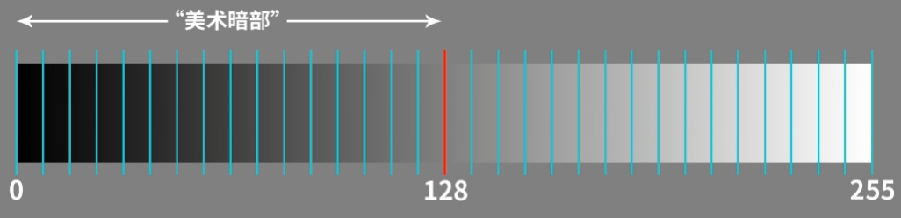
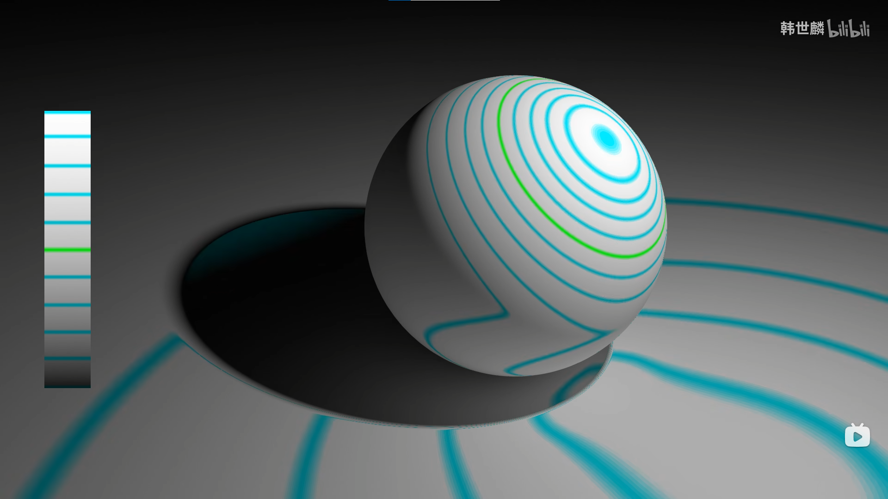
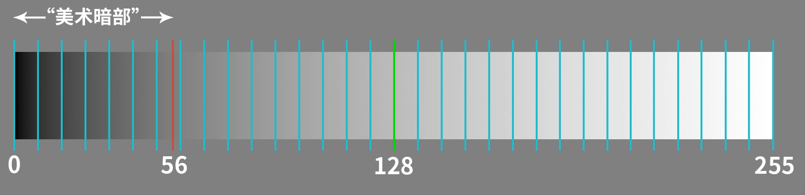
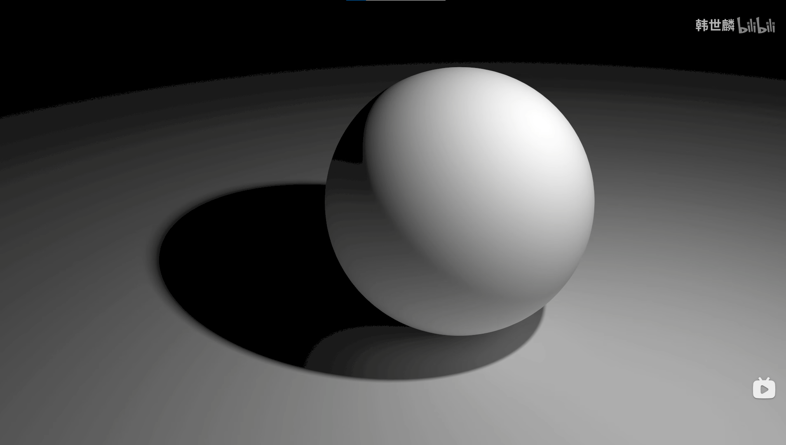
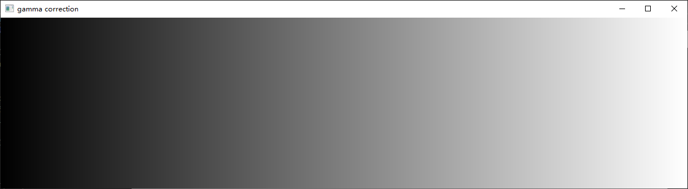
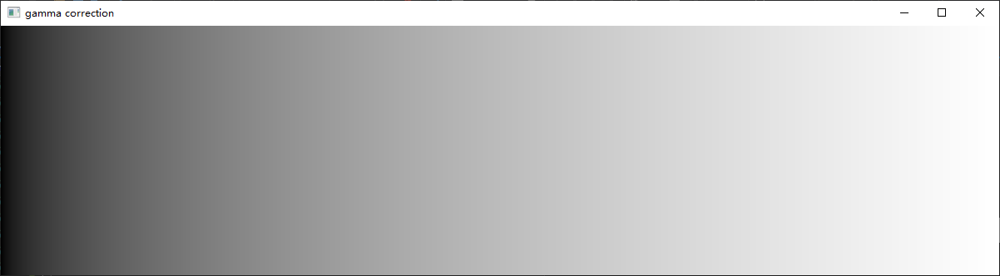

Hello

## 模板测试(Stencil Testing)

​	模板测试用指定的参考值与片段在模板缓冲的模板值进行比较，若没有通过比较则舍弃片段值。模板测试在片段着色器之后，深度测试之前被执行。

> 模板测试的目的：
>
> 利用已经本次绘制的物体，产生一个区域，在下次绘制中利用这个区域做一些效果。
>
> 模板测试的有两个要点：
>
> ​	1.模板测试，用于剔除片段 
>
> ​	2.模板缓冲更新，用于更新出一个模板区域出来，为下次绘制做准备

- `glStencilMask()`模板掩码，在写入模板缓冲时会进行&操作
- `glStencilFunc(GLenum func, GLint ref, GLuint mask)`模板函数
  - `func`应用在模板值和`ref`上，判断是否通过测试
  - `mask`对模板值和`ref`进行掩码操作
- `glStencilOp(GLenum sfail, GLenum dpfail, GLenum dppass)`被用来更新模板缓冲中的模板值。默认情况下`glStencilOp`是设置为`(GL_KEEP, GL_KEEP, GL_KEEP)`的，所以不论任何测试的结果是如何，模板缓冲都会保留它的值。默认的行为不会更新模板缓冲，所以如果你想写入模板缓冲的话，你需要至少对其中一个选项设置不同的值。
  - `sfail`模板测试失败时采取的行为。
  - `dpfail`模板测试通过，但深度测试失败时采取的行为。
  - `dppass`模板测试和深度测试都通过时采取的行为。

​	在代码中

- 在画地板时把模板掩码设为0，可以禁止写入模板缓冲。
- 画出物体后（所有都通过模板测试，再通过深度测试后），更新对应的模板值为1。
- 把物体放大，模板值不为1的地方通过模板测试（放大后的区域减掉了原来的物体）

## Gamma校正

[Gamma校正与线性工作流入门讲解--韩世麟](https://www.bilibili.com/video/BV15t411Y7cf?share_source=copy_web)

​	使用gamma校正的原因有两个：

- 人对光强的感知是非线性的，
- 数字图像的灰阶有限。

​	图1是光强从0-1的 灰阶颜色分布图。



<center>图1</center>

​	人眼会觉得上图中亮的地方比不亮的地方更多，这是因为人对物理光强的感知不是线性的，人会对暗的部分更加敏感，人对亮的部分感知力不够（人类能更敏锐感知到50%以上区域的灰度变化，却对不太能区分50%以下区域的亮度变化）据说这可能有助于我们及时发现黑暗中隐藏的危险。

<font color = red>	我们一般用8位来存储颜色，因此就有256个色阶，人眼识别范围肯定不止有256种色阶，我们就需要解决亮色部分就会精度而暗色就精度不足的问题，使两者平衡。</font>

​	我们把物理灰阶进行一个变换，把暗部拉伸，亮部压缩，得到一个暗部和亮部在人类感知范围内的一样多的情况，将这种灰阶称为美术灰阶，如图2。（这个图是把0.218变为0.5，然后把该点移动到对应位置上，再变回去的结果，能移动位置就是有限位数的误差问题，图2相当于gamma decode的结果）

<center>图2</center>

​	这样做的好处如下：

​	这是美术灰阶划分情形，在人眼感知的亮部和暗部之间划分均匀，各占50%。






​	这是物理灰阶的情形，物理灰阶（绿色），向高光区集中，人眼感知的美术灰部得的比例比较少。





​	由于人眼对灰色更加敏感，用少的灰阶表示灰色，画面就会出现巨大的色阶断层。



​	gamma校正后的图像是储存在电脑中的，并不会直接显示出来，比如说我一个像素光强为0.218，变化后为光强0.5，照0.5输出，那光强不是变大了吗？所以我们显示器会进行一个逆变换，把0.5转换为0.218。

​	一句话总结，gamma校正是把`0~1`的亮度整体变量往亮的方向压缩，使人眼识别的暗部变换后和亮部各占50%的色阶，避免了有限色阶表示暗部时会产生的色阶断层，屏幕在显示时会自动进行gamma变换（gamma校正的逆变换），显示正常的亮度。

​	直接输出（变暗了，这是gamma decode的结果，屏幕自动进行的）：



gamma矫正后：



​	gamma矫正方式：

```
    float gamma = 2.2;
    FragColor.rgb = pow(FragColor.rgb, vec3(1.0/gamma));
    or
    glEnable(GL_FRAMEBUFFER_SRGB);
```


​	经过gamma=2.2的校正后，处于sRGB颜色空间，这是非线性的颜色空间，颜色不能直接加减，比如(0+1)/2应该是亮灰色，而在sRGB空间下处理的结果是美术中灰。

​	8位图片大多都处于sRGB颜色空间，32位的图片由于能够表示的灰阶足够多，所以不用进行gamma校正，处于线性颜色空间，但是由于显示器会进行gamma操作，所以显示前需要进行gamma校正。
